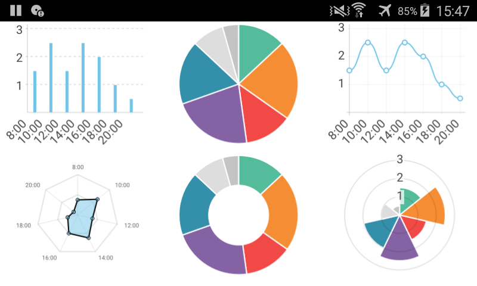

MCharts
===

[Online documentation](https://docs.milosolutions.com/milo-code-db/mcharts)

[Source code](https://github.com/milosolutions/mcharts)

# Getting Started

MChart implements some simple yet meaningful and eye friendly charts to display data. It's based on [QChart.js](https://github.com/jwintz/qchart.js): QML Bindings for Chart.js.

# How to use

1. Add mcharts.pri into your project.

2. Prepare some class that will provide data for MChart. For more information you can look at example project.

3. Compile and enjoy.

For example usage, see main.cpp file. This project is fully documented - please check doxygen docs or see the comments directly in the source file(s).

# License 

This project is licensed under the MIT License - see the LICENSE-MiloCodeDB.txt file for details

# Gallery

Here are some examples showing barcode scanner:

Charts running on Ubuntu desktop

Doughnut chart on Windows

Pie chart on Windows

Polar chart on Windows
